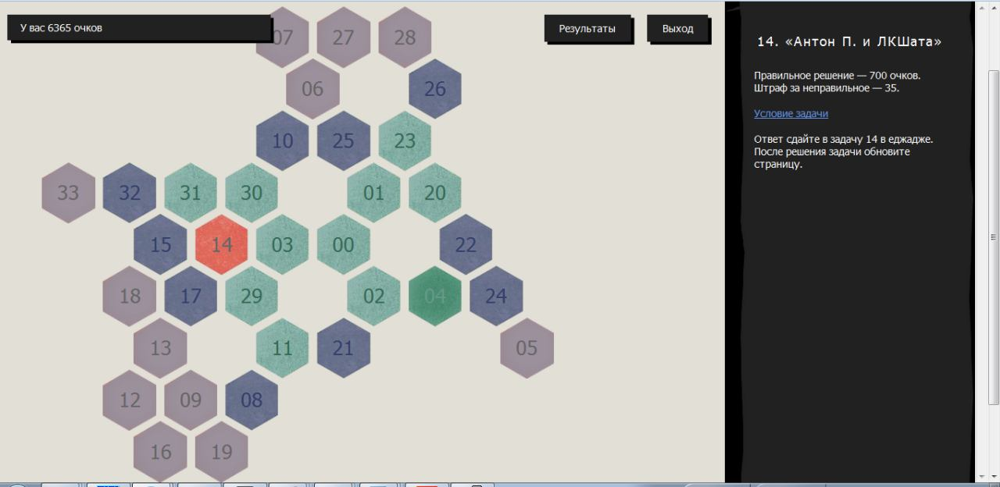

# Движок для новогодней олимпиады ЛКШ 2016.Зима

В ЛКШ 2016.Зима новогодняя олимпиада по программированию была проведена в необычном формате. Команды из 5-6 человек получали доступ к полю из задач-шестиугольников:

Зелёные задачи — решённые, красные — бонусы (об этом чуть позже), синие — нерёшнные, серые — неоткрытые. Решив задачу, участники получают возможность прочитать условия задач вокруг решённой.
У каждой задачи есть тайм-аут: время, через которое она все равно станет открытой.

Большинство задач дают баллы тем, кто её решил, но некоторые задачи являются бонусами. Бонусы бывают трёх типов: получить мандаринки, открыть в следующий раз после решения задач окрестность размера 2, а не 1, 
или вызвать Андрея Станкевича на 2 минуты для консультации.

За неправильные попытки начисляется штраф. Штраф не может превышать 70% исходной стоимости задачи (но это настраивается).

# Где что лежит

В папке `src` — обычное джанго-приложение. Настройки лежат в `src/olymp/settings.py`. Важные настройки — в конце этого файла. 
Там можно указать путь до еджаждевского `serve.cfg`, токен для телеграм-бота и идентификатор телеграм-чата. В этот чат будут приходит оповещения о том, что кто-то взял бонус.

Запускать на сервере любым доступным и привычным для джанго-приложений способом. Например, в связке с `nginx` и `uwsgi`.
